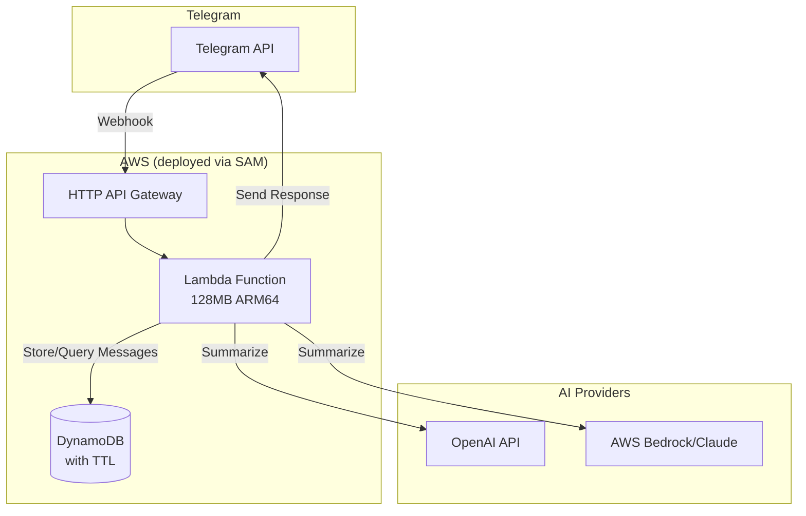

# Design Document: Telegram AI Summary Bot

## Overview

The Telegram AI Summary Bot is a serverless application that helps users catch up on missed group chat discussions through AI-powered summaries. The system uses AWS Lambda for compute, DynamoDB for temporary message storage, and supports pluggable AI providers (OpenAI or AWS Bedrock/Claude).

The architecture follows a webhook-based event-driven pattern where Telegram sends updates to an API Gateway endpoint, which triggers a Lambda function to process commands and store messages. Summaries are generated on-demand using a provider-agnostic AI abstraction layer.

## Architecture



### Request Flow

1. Telegram sends webhook updates to API Gateway
2. API Gateway invokes Lambda function
3. Lambda parses the update and determines action:
   - Text message → Store in DynamoDB
   - /summary command → Fetch messages, call AI provider, respond
   - /help command → Respond with help text
   - Bot added to group → Send welcome message
4. Lambda sends response back to Telegram

## Components and Interfaces

### 1. Webhook Handler

The entry point Lambda function that processes all incoming Telegram updates.

```typescript
interface TelegramUpdate {
  update_id: number;
  message?: Message;
}

interface Message {
  message_id: number;
  chat: Chat;
  from?: User;
  date: number;
  text?: string;
  new_chat_members?: User[];
  reply_to_message?: Message; // Thread context
  message_thread_id?: number; // Forum topic ID (for supergroups with topics)
}

interface Chat {
  id: number;
  type: 'group' | 'supergroup' | 'private';
  title?: string;
}

interface User {
  id: number;
  username?: string;
  first_name: string;
}

// Main handler function
async function handleWebhook(update: TelegramUpdate): Promise<void> {
  if (update.message?.new_chat_members) {
    await handleBotAdded(update.message);
  } else if (update.message?.text?.startsWith('/')) {
    await handleCommand(update.message);
  } else if (update.message?.text) {
    await storeMessage(update.message);
  }
}
```

### 2. Command Router

Routes bot commands to appropriate handlers.

```typescript
interface CommandHandler {
  execute(message: Message, args: string[]): Promise<void>;
}

class CommandRouter {
  private handlers: Map<string, CommandHandler>;
  
  async route(message: Message): Promise<void> {
    const [command, ...args] = message.text!.split(' ');
    const handler = this.handlers.get(command);
    if (handler) {
      await handler.execute(message, args);
    }
  }
}
```

### 3. Message Store

Interface for storing and retrieving messages from DynamoDB.

```typescript
interface StoredMessage {
  chatId: number;
  timestamp: number;
  messageId: number;
  userId: number;
  username: string;
  text: string;
  expireAt: number; // TTL in epoch seconds
  replyToMessageId?: number; // ID of message being replied to (for thread context)
  threadId?: number; // Forum topic ID (for supergroups with topics)
  forwardFromName?: string; // Original author name for forwarded messages
}

interface MessageQuery {
  chatId: number;
  startTime?: number;
  endTime?: number;
  limit?: number;
}

interface MessageStore {
  store(message: StoredMessage): Promise<void>;
  query(query: MessageQuery): Promise<StoredMessage[]>;
  deleteAll(chatId: number): Promise<void>;
}
```

### 4. AI Provider Interface

Provider-agnostic interface for AI summarization.

```typescript
interface SummarizeOptions {
  maxTokens?: number;
  temperature?: number;
}

interface AIProvider {
  summarize(messages: string[], options?: SummarizeOptions): Promise<string>;
  getMaxContextTokens(): number;
}

// Factory function
function createAIProvider(providerType: 'openai' | 'bedrock'): AIProvider {
  switch (providerType) {
    case 'openai':
      return new OpenAIProvider();
    case 'bedrock':
      return new BedrockProvider();
  }
}
```

### 5. Summary Engine

Orchestrates the summarization process including chunking for long conversations.

```typescript
interface SummaryEngine {
  generateSummary(chatId: number, range: MessageRange): Promise<string>;
}

interface MessageRange {
  type: 'time' | 'count';
  value: number; // hours for time, count for count
}

class DefaultSummaryEngine implements SummaryEngine {
  constructor(
    private messageStore: MessageStore,
    private aiProvider: AIProvider,
    private formatter: SummaryFormatter
  ) {}
  
  async generateSummary(chatId: number, range: MessageRange): Promise<string> {
    const messages = await this.fetchMessages(chatId, range);
    if (messages.length === 0) {
      throw new NoMessagesError();
    }
    
    const formattedMessages = this.formatForAI(messages);
    const tokenCount = this.estimateTokens(formattedMessages);
    
    if (tokenCount > this.aiProvider.getMaxContextTokens()) {
      return this.hierarchicalSummarize(formattedMessages);
    }
    
    const rawSummary = await this.aiProvider.summarize(formattedMessages);
    return this.formatter.format(rawSummary);
  }
}
```

### 6. Summary Formatter

Formats AI output into Telegram-friendly format.

```typescript
interface SummaryFormatter {
  format(rawSummary: string): string;
}

// Output format:
// 🧵 Summary of recent discussion
// • Topic: [topic] – [details]
// • Topic: [topic] – [details]
// ❓ Open questions
// • [question]
```

### 7. Telegram Client

Wrapper for Telegram Bot API calls with markdown fallback support.

```typescript
interface TelegramClient {
  sendMessage(chatId: number, text: string): Promise<void>;
}
```

**Markdown Handling:**
The client sends messages with Telegram's legacy Markdown mode. If Telegram returns a parsing error (400 "can't parse entities"), the client automatically retries without markdown formatting. This handles cases where AI-generated summaries contain unbalanced or invalid markdown.

**Telegram Markdown Rules (Legacy Mode):**
- Use `*bold*` for bold (NOT `**double**`)
- Use `_italic_` for italic
- Do NOT nest formatting
- Escape special characters (`_`, `*`, `` ` ``, `[`) with backslash when used literally

## Data Models

### DynamoDB Table: Messages

| Attribute | Type | Description |
|-----------|------|-------------|
| chatId (PK) | Number | Telegram chat ID |
| timestamp (SK) | Number | Message timestamp in milliseconds |
| messageId | Number | Telegram message ID |
| userId | Number | Sender's Telegram user ID |
| username | String | Sender's username or first name |
| text | String | Message text content |
| expireAt | Number | TTL timestamp (72 hours from creation) |
| replyToMessageId | Number | ID of message being replied to (optional, for thread context) |
| threadId | Number | Forum topic ID (optional, for supergroups with topics) |
| forwardFromName | String | Original author name for forwarded messages (optional) |

### Thread Handling

The bot handles message threads in two ways:

1. **Reply Threads**: When a message is a reply to another message, the `replyToMessageId` is stored. During summarization, the AI prompt includes thread context to help identify conversation threads.

2. **Forum Topics** (Supergroups with Topics enabled): Messages include a `threadId` that identifies the forum topic. The `/summary` command summarizes all topics by default, but could be extended to support `/summary topic:123` syntax.

For summarization, messages are grouped by thread context when formatting for the AI, helping it identify distinct conversation threads within the chat.

### DynamoDB Access Patterns

1. **Store message**: PutItem with chatId + timestamp
2. **Query by time range**: Query with chatId and timestamp between start/end
3. **Query by count**: Query with chatId, ScanIndexForward=false, Limit=N
4. **Delete all for chat**: Query + BatchWriteItem delete

### Environment Configuration

| Variable | Description | Example |
|----------|-------------|---------|
| LLM_PROVIDER | AI provider selection | "openai" or "bedrock" |
| TELEGRAM_BOT_TOKEN | Bot API token (encrypted env var) | "123456:ABC-DEF..." |
| OPENAI_API_KEY | OpenAI API key (encrypted env var) | "sk-..." |
| DYNAMODB_TABLE | DynamoDB table name | "telegram-summary-messages" |
| MESSAGE_TTL_HOURS | Message retention period | "72" |
| DEFAULT_SUMMARY_HOURS | Default summary window | "24" |

Note: Sensitive credentials (TELEGRAM_BOT_TOKEN, OPENAI_API_KEY) are stored as encrypted Lambda environment variables using AWS KMS. This approach is cost-effective (no Secrets Manager fees) while maintaining security through encryption at rest.

## Cost Optimization

### AWS Free Tier Alignment

| Service | Free Tier Limit | Expected Usage | Strategy |
|---------|-----------------|----------------|----------|
| Lambda | 1M requests/month, 400K GB-seconds | ~1K requests/month | Use 128MB memory, optimize cold starts |
| API Gateway | 1M HTTP API calls/month | ~1K calls/month | Use HTTP API (not REST API) - 70% cheaper |
| DynamoDB | 25 GB storage, 25 WCU/RCU | <1 GB with TTL | On-demand capacity, TTL auto-cleanup |
| CloudWatch | 5 GB logs/month | <100 MB/month | Set log retention to 7 days |

### Optimization Strategies

1. **Lambda Memory Optimization**
   - Start with 128MB (minimum)
   - Profile and adjust only if needed
   - Use ARM64 architecture (Graviton2) - 20% cheaper

2. **DynamoDB Cost Control**
   - Use On-Demand capacity (no provisioned costs for low traffic)
   - TTL automatically deletes expired messages (no manual cleanup)
   - Single table design (no additional tables)

3. **AI Provider Cost Management**
   - **OpenAI**: Use gpt-3.5-turbo (~$0.002/1K tokens) instead of gpt-4
   - **Bedrock**: Use Claude 3 Haiku (~$0.00025/1K input tokens) for cost efficiency
   - Implement token counting before API calls to estimate costs
   - Set max_tokens limit to prevent runaway costs
   - Cache summaries briefly (5 min) to avoid duplicate AI calls

4. **API Gateway Optimization**
   - Use HTTP API instead of REST API (significantly cheaper)
   - No custom domain (avoids Route 53 costs)

5. **Logging Cost Control**
   - Set CloudWatch log retention to 7 days
   - Log only errors and important events in production
   - Use structured logging for efficient querying

### Estimated Monthly Cost (Low Traffic)

| Component | Estimated Cost |
|-----------|---------------|
| Lambda | $0.00 (within free tier) |
| API Gateway | $0.00 (within free tier) |
| DynamoDB | $0.00 (within free tier) |
| CloudWatch | $0.00 (within free tier) |
| OpenAI API | ~$0.10-0.50 (depends on usage) |
| **Total** | **~$0.10-0.50/month** |

Note: The only non-free cost is the AI provider API calls. For personal/small group use with ~100 summaries/month, expect <$1/month total.


## Correctness Properties

*A property is a characteristic or behavior that should hold true across all valid executions of a system—essentially, a formal statement about what the system should do. Properties serve as the bridge between human-readable specifications and machine-verifiable correctness guarantees.*

### Property 1: Message Storage Completeness

*For any* valid text message received from Telegram, the stored message SHALL contain all required fields: chatId, messageId, username, timestamp, and text, with none being null or undefined.

**Validates: Requirements 2.1**

### Property 2: Non-Text Message Filtering

*For any* Telegram update that does not contain a text message (stickers, media, join/leave notifications), the Message_Store SHALL not create any new records.

**Validates: Requirements 2.2**

### Property 3: TTL Configuration

*For any* message stored in the Message_Store, the expireAt field SHALL be set to exactly 72 hours (259200 seconds) after the message timestamp.

**Validates: Requirements 2.3**

### Property 4: Time Parameter Parsing

*For any* /summary command with a valid time parameter (e.g., "1h", "2h", "30m"), the Summary_Engine SHALL calculate the correct start timestamp as (current_time - specified_duration).

**Validates: Requirements 3.2**

### Property 5: Count Parameter Parsing

*For any* /summary command with a valid count parameter (e.g., "50", "100"), the message query SHALL limit results to exactly that number of most recent messages.

**Validates: Requirements 3.3**

### Property 6: Summary Output Formatting

*For any* non-empty summary generated by the AI provider, the formatted output SHALL contain the header emoji (🧵), topic bullet points (•), and the open questions section (❓).

**Validates: Requirements 3.4**

### Property 7: AI Error Handling

*For any* error returned by the AI provider, the Bot's response to the user SHALL NOT contain stack traces, API keys, or internal error codes, and SHALL contain a user-friendly explanation.

**Validates: Requirements 5.4, 8.1**

### Property 8: Hierarchical Summarization

*For any* message set that exceeds the AI provider's token limit, the Summary_Engine SHALL:
1. Split messages into chunks that fit within the token limit
2. Generate a summary for each chunk
3. Combine chunk summaries into a final summary

**Validates: Requirements 6.1, 6.2, 6.3, 8.3**

## Error Handling

### Error Categories

| Error Type | User Message | Internal Action |
|------------|--------------|-----------------|
| No messages found | "No recent messages to summarize. Try a longer time range." | Log info, return early |
| AI provider timeout | "Summary generation is taking too long. Please try again." | Log error, retry once |
| AI provider error | "Unable to generate summary right now. Please try again later." | Log error with details |
| Invalid command syntax | "Invalid command. Use /help to see available commands." | Log warning |
| DynamoDB error | "Something went wrong. Please try again." | Log error, alert |

### Error Response Format

```typescript
interface ErrorResponse {
  success: false;
  userMessage: string;
  // Internal fields (not sent to user)
  errorCode: string;
  originalError?: Error;
}

function handleError(error: Error): ErrorResponse {
  // Never expose internal details to users
  // Log full error internally
  // Return sanitized user message
}
```

### Retry Strategy

- AI provider calls: 1 retry with exponential backoff (1s delay)
- DynamoDB operations: 2 retries with exponential backoff
- Telegram API calls: 2 retries with 500ms delay

## Testing Strategy

### Unit Tests

Unit tests verify specific examples, edge cases, and error conditions:

1. **Command Parsing Tests**
   - Parse /summary without arguments → default 24h range
   - Parse /summary 1h → 1 hour range
   - Parse /summary 50 → 50 message limit
   - Parse invalid command → error response

2. **Message Storage Tests**
   - Store text message → all fields present
   - Receive sticker → no storage
   - Receive media → no storage
   - TTL calculation → 72 hours from timestamp

3. **Summary Formatting Tests**
   - Format valid summary → contains required elements
   - Format empty summary → appropriate message

4. **Error Handling Tests**
   - AI timeout → user-friendly message
   - No messages → clear explanation
   - Invalid parameters → helpful error

### Property-Based Tests

Property-based tests verify universal properties across many generated inputs. Each test runs minimum 100 iterations.

**Testing Framework**: fast-check (TypeScript property-based testing library)

1. **Feature: telegram-summary-bot, Property 1: Message Storage Completeness**
   - Generate random valid text messages
   - Verify all required fields are stored

2. **Feature: telegram-summary-bot, Property 2: Non-Text Message Filtering**
   - Generate random non-text updates (stickers, media, etc.)
   - Verify no records created

3. **Feature: telegram-summary-bot, Property 3: TTL Configuration**
   - Generate random messages with various timestamps
   - Verify expireAt = timestamp + 72 hours

4. **Feature: telegram-summary-bot, Property 4: Time Parameter Parsing**
   - Generate random valid time strings (Nh, Nm format)
   - Verify correct duration calculation

5. **Feature: telegram-summary-bot, Property 5: Count Parameter Parsing**
   - Generate random valid count numbers
   - Verify query limit matches input

6. **Feature: telegram-summary-bot, Property 6: Summary Output Formatting**
   - Generate random AI summary outputs
   - Verify formatted output contains required elements

7. **Feature: telegram-summary-bot, Property 7: AI Error Handling**
   - Generate random error types and messages
   - Verify no sensitive data in user response

8. **Feature: telegram-summary-bot, Property 8: Hierarchical Summarization**
   - Generate message sets of varying sizes (including over token limit)
   - Verify chunking and combination behavior

### Integration Tests

1. **End-to-end webhook flow**: Telegram update → Lambda → DynamoDB → Response
2. **AI provider integration**: Test with mock AI provider
3. **DynamoDB operations**: Store, query, TTL verification

### Test Configuration

```typescript
// fast-check configuration
fc.configureGlobal({
  numRuns: 100,
  verbose: true,
});
```

## Deployment (AWS SAM)

### SAM Template Structure

```yaml
AWSTemplateFormatVersion: '2010-09-09'
Transform: AWS::Serverless-2016-10-31
Description: Telegram AI Summary Bot

Globals:
  Function:
    Timeout: 30
    Runtime: nodejs18.x
    Architectures:
      - arm64
    MemorySize: 128

Resources:
  TelegramBotFunction:
    Type: AWS::Serverless::Function
    Properties:
      Handler: dist/handler.handler
      Environment:
        Variables:
          DYNAMODB_TABLE: !Ref MessagesTable
          LLM_PROVIDER: openai
          # TELEGRAM_BOT_TOKEN and OPENAI_API_KEY set via sam deploy --parameter-overrides
      Policies:
        - DynamoDBCrudPolicy:
            TableName: !Ref MessagesTable
      Events:
        Webhook:
          Type: HttpApi
          Properties:
            Path: /webhook
            Method: POST

  MessagesTable:
    Type: AWS::DynamoDB::Table
    Properties:
      BillingMode: PAY_PER_REQUEST
      AttributeDefinitions:
        - AttributeName: chatId
          AttributeType: N
        - AttributeName: timestamp
          AttributeType: N
      KeySchema:
        - AttributeName: chatId
          KeyType: HASH
        - AttributeName: timestamp
          KeyType: RANGE
      TimeToLiveSpecification:
        AttributeName: expireAt
        Enabled: true

Outputs:
  WebhookUrl:
    Description: Webhook URL for Telegram
    Value: !Sub "https://${ServerlessHttpApi}.execute-api.${AWS::Region}.amazonaws.com/webhook"
```

### Deployment Commands

```bash
# Build the Lambda function
sam build

# Deploy (first time - guided)
sam deploy --guided

# Deploy (subsequent)
sam deploy

# Local testing
sam local invoke TelegramBotFunction -e events/test-message.json
```
