# Architecture Documentation

This document provides detailed architectural documentation for the Telegram AI Summary Bot, including C4 model diagrams, component interactions, and design decisions.

---

## C4 Model

### Level 1: System Context

The highest-level view showing the system boundaries and external actors.

```mermaid
flowchart TB
    subgraph boundary [" "]
        System[("🤖 Telegram Summary Bot<br/><br/>Serverless application that<br/>generates AI-powered summaries<br/>of group chat discussions")]
    end
    
    GroupMember((👤 Group Member<br/>Requests summaries,<br/>sends messages))
    
    BotAdmin((👔 Bot Admin<br/>Configures and<br/>deploys the bot))
    
    TelegramAPI[/"📱 Telegram Bot API<br/>Webhook delivery,<br/>message sending"/]
    
    OpenAI[/"🧠 OpenAI API<br/>GPT-3.5-turbo<br/>summarization"/]
    
    Bedrock[/"☁️ AWS Bedrock<br/>Claude 3 Haiku<br/>summarization"/]
    
    GroupMember -->|"Sends messages,<br/>requests /summary"| System
    BotAdmin -->|"Deploys, configures<br/>AI provider"| System
    
    System -->|"Receives webhooks,<br/>sends responses"| TelegramAPI
    System -->|"Summarize messages"| OpenAI
    System -->|"Summarize messages"| Bedrock
    
    style System fill:#232F3E,color:#fff
    style TelegramAPI fill:#0088CC,color:#fff
    style OpenAI fill:#10A37F,color:#fff
    style Bedrock fill:#FF9900,color:#fff
```



### Level 2: Container Diagram

Shows the major containers/services within the system.

```mermaid
flowchart TB
    subgraph boundary["Telegram Summary Bot"]
        direction TB
        
        subgraph api["API Layer"]
            APIGW[HTTP API Gateway<br/>AWS API Gateway v2]
        end
        
        subgraph compute["Compute Layer"]
            Lambda[Webhook Handler<br/>AWS Lambda<br/>Node.js 18.x / ARM64]
        end
        
        subgraph data["Data Layer"]
            DDB[(Messages Table<br/>AWS DynamoDB<br/>On-Demand Capacity)]
        end
        
        subgraph logs["Observability"]
            CW[CloudWatch Logs<br/>7-day retention]
        end
    end
    
    TG[/"📱 Telegram API"/]
    OpenAI[/"🧠 OpenAI API"/]
    Bedrock[/"☁️ AWS Bedrock"/]
    
    TG -->|"POST /webhook"| APIGW
    APIGW -->|"Invoke"| Lambda
    Lambda -->|"Store/Query"| DDB
    Lambda -->|"Summarize"| OpenAI
    Lambda -->|"Summarize"| Bedrock
    Lambda -->|"sendMessage"| TG
    Lambda -.->|"Logs"| CW
    
    style APIGW fill:#FF9900,color:#fff
    style Lambda fill:#FF9900,color:#fff
    style DDB fill:#7AA116,color:#fff
    style CW fill:#FF9900,color:#fff
    style OpenAI fill:#10A37F,color:#fff
    style Bedrock fill:#232F3E,color:#fff
```



### Level 3: Component Diagram

Internal structure of the Lambda function.


---

## Data Flow Diagrams

### Message Ingestion Flow

```mermaid
sequenceDiagram
    autonumber
    participant U as 👤 User
    participant TG as Telegram
    participant GW as API Gateway
    participant L as Lambda
    participant DB as DynamoDB
    
    U->>TG: Send text message or photo with caption
    TG->>GW: POST /webhook<br/>{update_id, message}
    GW->>L: Invoke handler
    
    L->>L: Parse TelegramUpdate
    L->>L: Check: isTextMessage?<br/>(text or caption)
    
    alt Has text or caption
        L->>L: Extract fields:<br/>chatId, messageId,<br/>username, text/caption
        L->>L: getMessageText()<br/>(adds [📷 Photo] prefix for captions)
        L->>L: Calculate TTL:<br/>timestamp + 72h
        L->>DB: PutItem(StoredMessage)
        DB-->>L: Success
    else No text content (sticker/media without caption)
        L->>L: Ignore message
    end
    
    L-->>GW: 200 OK
    GW-->>TG: Acknowledge
```



### Summary Generation Flow

```mermaid
sequenceDiagram
    autonumber
    participant U as 👤 User
    participant TG as Telegram
    participant L as Lambda
    participant CR as CommandRouter
    participant SH as SummaryHandler
    participant SE as SummaryEngine
    participant DB as DynamoDB
    participant AI as AI Provider
    participant SF as SummaryFormatter
    
    U->>TG: /summary 2h
    TG->>L: POST /webhook
    
    L->>CR: route(message)
    CR->>CR: parseCommand("/summary 2h")
    CR->>SH: execute(message, ["2h"])
    
    SH->>SH: parseSummaryParameter("2h")<br/>→ {type: 'time', value: 2}
    
    SH->>SE: generateSummary(chatId, range)
    
    SE->>DB: query({chatId, startTime, endTime})
    DB-->>SE: StoredMessage[]
    
    alt Messages found
        SE->>SE: formatMessagesForAI(messages)
        SE->>SE: estimateTokenCount()
        
        alt Within token limit
            SE->>AI: summarize(formattedMessages)
            AI-->>SE: rawSummary
        else Exceeds token limit
            SE->>SE: splitIntoChunks()
            loop Each chunk
                SE->>AI: summarize(chunk)
                AI-->>SE: chunkSummary
            end
            SE->>AI: combineChunkSummaries()
            AI-->>SE: finalSummary
        end
        
        SE-->>SH: rawSummary
        SH->>SF: format(rawSummary)
        SF-->>SH: formattedSummary
        SH->>TG: sendMessage(formattedSummary)
    else No messages
        SE-->>SH: throw NoMessagesError
        SH->>TG: sendMessage("No messages found")
    end
    
    TG-->>U: 📝 Summary displayed
```



### Bot Added to Group Flow


---

## State Diagrams

### Message Lifecycle

```mermaid
stateDiagram-v2
    [*] --> Received: Telegram webhook
    
    Received --> Filtered: No text or caption
    Received --> Stored: Has text or caption
    
    Filtered --> [*]: Ignored
    
    Stored --> Active: In DynamoDB
    
    Active --> Queried: /summary command
    Active --> Expired: TTL reached (72h)
    
    Queried --> Active: Still within TTL
    
    Expired --> Deleted: DynamoDB TTL cleanup
    
    Deleted --> [*]
    
    note right of Stored
        Fields stored:
        • chatId (PK)
        • timestamp (SK)
        • messageId
        • username
        • text (with [📷 Photo] prefix for captions)
        • expireAt
    end note
    
    note right of Expired
        Automatic cleanup
        by DynamoDB TTL
        No manual deletion
    end note
```



### Command Processing State


---

## Deployment Architecture

### AWS SAM Deployment


### Infrastructure as Code

```yaml
# Key SAM Template Resources
Resources:
  TelegramBotFunction:
    Type: AWS::Serverless::Function
    Properties:
      Runtime: nodejs18.x
      Architectures: [arm64]
      MemorySize: 128
      Timeout: 30
      
  TelegramBotApi:
    Type: AWS::Serverless::HttpApi
    Properties:
      StageName: prod
      
  MessagesTable:
    Type: AWS::DynamoDB::Table
    Properties:
      BillingMode: PAY_PER_REQUEST
      TimeToLiveSpecification:
        AttributeName: expireAt
        Enabled: true
```

---

## Security Architecture

### Security Layers

```mermaid
flowchart TB
    subgraph External["🌐 External"]
        TG[Telegram API]
        AI[AI Providers]
    end
    
    subgraph Edge["🛡️ Edge Security"]
        APIGW[API Gateway<br/>HTTPS only]
    end
    
    subgraph Compute["🔐 Compute Security"]
        Lambda[Lambda<br/>IAM Role<br/>Least Privilege]
        ENV[Encrypted Env Vars<br/>KMS encryption]
    end
    
    subgraph Data["💾 Data Security"]
        DDB[DynamoDB<br/>SSE enabled<br/>VPC optional]
        TTL[TTL Auto-Delete<br/>72h retention]
    end
    
    TG -->|HTTPS| APIGW
    APIGW --> Lambda
    Lambda --> ENV
    Lambda -->|IAM Auth| DDB
    Lambda -->|API Key| AI
    DDB --> TTL
    
    style APIGW fill:#DD344C,color:#fff
    style Lambda fill:#8C4FFF,color:#fff
    style DDB fill:#7AA116,color:#fff
```



### IAM Permissions (Least Privilege)

```yaml
Policies:
  # DynamoDB access - only to specific table
  - DynamoDBCrudPolicy:
      TableName: !Ref MessagesTable
      
  # Bedrock access - only specific models
  - Version: '2012-10-17'
    Statement:
      - Effect: Allow
        Action: bedrock:InvokeModel
        Resource:
          - arn:aws:bedrock:*::foundation-model/anthropic.claude-3-haiku-20240307-v1:0
          - arn:aws:bedrock:*::foundation-model/anthropic.claude-3-sonnet*
```

### Sensitive Data Handling

```mermaid
flowchart LR
    subgraph Secrets["🔑 Secrets"]
        BOT[Bot Token]
        API[API Keys]
    end
    
    subgraph Storage["💾 Storage"]
        KMS[KMS Encrypted<br/>Lambda Env Vars]
    end
    
    subgraph Runtime["⚡ Runtime"]
        Lambda[Lambda Function]
    end
    
    subgraph Protection["🛡️ Protection"]
        Sanitize[Error Sanitization<br/>No secrets in logs]
    end
    
    BOT --> KMS
    API --> KMS
    KMS --> Lambda
    Lambda --> Sanitize
    
    style KMS fill:#DD344C,color:#fff
    style Sanitize fill:#7AA116,color:#fff
```



---

## Error Handling Architecture

### Error Classification

```mermaid
flowchart TB
    subgraph Errors["❌ Error Types"]
        direction LR
        E1[NoMessagesError]
        E2[AIProviderError]
        E3[AIProviderTimeoutError]
        E4[DynamoDBError]
        E5[InvalidCommandError]
        E6[TelegramAPIError]
        E7[ConfigurationError]
    end
    
    subgraph Handler["🛡️ Error Handler"]
        Classify[getErrorCode]
        Sanitize[sanitizeMessage]
        Map[getUserFriendlyMessage]
    end
    
    subgraph Output["📤 Outputs"]
        User[User Message<br/>Safe, friendly]
        Log[Internal Log<br/>Sanitized details]
    end
    
    Errors --> Classify
    Classify --> Sanitize
    Sanitize --> Map
    Map --> User
    Sanitize --> Log
    
    style Classify fill:#DD344C,color:#fff
    style User fill:#7AA116,color:#fff
```



### Error Response Mapping

| Error Code | Internal Cause | User Message |
|------------|----------------|--------------|
| `NO_MESSAGES` | Empty query result | "No recent messages to summarize." |
| `AI_PROVIDER_ERROR` | API failure | "Unable to generate summary right now." |
| `AI_PROVIDER_TIMEOUT` | Request timeout | "Summary generation is taking too long." |
| `DYNAMODB_ERROR` | Database error | "Something went wrong. Please try again." |
| `INVALID_COMMAND` | Parse failure | "Invalid command. Use /help." |
| `CONFIGURATION_ERROR` | Missing config | "Bot is not properly configured." |

---

## Performance Considerations

### Cold Start Optimization

```mermaid
flowchart LR
    subgraph ColdStart["❄️ Cold Start"]
        Init[Initialize]
        Load[Load Dependencies]
        Create[Create Clients]
    end
    
    subgraph WarmStart["🔥 Warm Start"]
        Reuse[Reuse Cached<br/>Clients]
    end
    
    subgraph Optimizations["⚡ Optimizations"]
        ARM[ARM64 Architecture<br/>Faster startup]
        Bundle[esbuild Bundle<br/>Smaller package]
        Cache[Singleton Pattern<br/>Client reuse]
    end
    
    ColdStart --> Optimizations
    Optimizations --> WarmStart
    
    style ARM fill:#7AA116,color:#fff
    style Bundle fill:#7AA116,color:#fff
    style Cache fill:#7AA116,color:#fff
```



### Caching Strategy

```typescript
// Lambda cold start optimization
let cachedTelegramClient: TelegramClient | null = null;
let cachedMessageStore: MessageStore | null = null;

function getTelegramClient(): TelegramClient {
  if (!cachedTelegramClient) {
    cachedTelegramClient = createTelegramClient();
  }
  return cachedTelegramClient;
}
```

---

## Scalability

### Serverless Scaling


### Bottlenecks and Mitigations

| Bottleneck | Mitigation |
|------------|------------|
| AI Provider Rate Limits | Retry with exponential backoff |
| DynamoDB Throughput | On-demand capacity auto-scales |
| Lambda Cold Starts | ARM64 + minimal dependencies |
| Token Limits | Hierarchical summarization |

---

## Monitoring and Observability

### CloudWatch Integration


### Key Metrics

| Metric | Description | Alert Threshold |
|--------|-------------|-----------------|
| Invocations | Total Lambda calls | N/A (informational) |
| Duration | Execution time | > 10s |
| Errors | Failed executions | > 5% error rate |
| Throttles | Rate limited calls | > 0 |
| ConcurrentExecutions | Parallel runs | > 80% of limit |

---

## Future Considerations

### Potential Enhancements


### Extensibility Points

1. **AI Providers**: Add new providers by implementing `AIProvider` interface
2. **Commands**: Add new commands by implementing `CommandHandler` interface
3. **Storage**: Swap DynamoDB for other stores via `MessageStore` interface
4. **Formatting**: Customize output via `SummaryFormatter` interface
