# Deployment Guide

This guide covers deploying the Telegram AI Summary Bot to AWS using SAM (Serverless Application Model).

---

## Table of Contents

- [Prerequisites](#prerequisites)
- [Quick Start](#quick-start)
- [Deployment Options](#deployment-options)
- [Configuration](#configuration)
- [Webhook Registration](#webhook-registration)
- [Local Development](#local-development)
- [Troubleshooting](#troubleshooting)

---

## Prerequisites

### Required Tools

```mermaid
flowchart LR
    subgraph Tools["🛠️ Required Tools"]
        Node[Node.js 18+]
        AWS[AWS CLI]
        SAM[AWS SAM CLI]
        Docker[Docker<br/>for local testing]
    end
    
    subgraph Accounts["🔑 Accounts"]
        AWSAcc[AWS Account]
        TG[Telegram Bot<br/>from BotFather]
        AI[OpenAI Account<br/>or AWS Bedrock]
    end
    
    style Node fill:#7AA116,color:#fff
    style AWS fill:#FF9900,color:#fff
    style SAM fill:#FF9900,color:#fff
```



### Installation

```bash
# Node.js (via nvm)
nvm install 18
nvm use 18

# AWS CLI
brew install awscli  # macOS
# or: https://aws.amazon.com/cli/

# AWS SAM CLI
brew install aws-sam-cli  # macOS
# or: https://docs.aws.amazon.com/serverless-application-model/latest/developerguide/install-sam-cli.html

# Docker (for local testing)
brew install --cask docker  # macOS
```

### AWS Configuration

```bash
# Configure AWS credentials
aws configure

# Verify configuration
aws sts get-caller-identity
```

### Telegram Bot Token

1. Open Telegram and search for [@BotFather](https://t.me/botfather)
2. Send `/newbot` and follow the prompts
3. Copy the bot token (format: `123456789:ABCdefGHIjklMNOpqrsTUVwxyz`)
4. **Important**: Disable Privacy Mode:
   - Send `/mybots` to BotFather
   - Select your bot → Bot Settings → Group Privacy → Turn off

### OpenAI API Key (if using OpenAI)

1. Go to [OpenAI Platform](https://platform.openai.com/)
2. Navigate to API Keys
3. Create a new secret key
4. Copy the key (format: `sk-...`)

---

## Quick Start

### 1. Clone and Install

```bash
git clone <repository-url>
cd telegram-summary-bot
npm install
```

### 2. Build

```bash
npm run bundle:prod
```

### 3. Deploy (First Time)

```bash
npm run deploy:guided
```

This will prompt for:
- Stack name (e.g., `telegram-summary-bot`)
- AWS Region
- Telegram Bot Token
- OpenAI API Key
- LLM Provider (`openai` or `bedrock`)

### 4. Register Webhook

```bash
npm run register-webhook
```

### 5. Test

Add the bot to a Telegram group and send `/help`.

---

## Deployment Options

### Guided Deployment (First Time)

```bash
npm run deploy:guided
# or
sam deploy --guided
```

Interactive prompts will configure:
- Stack name
- Region
- Parameters
- IAM capabilities

Configuration is saved to `samconfig.toml`.

### Standard Deployment

```bash
npm run deploy
# or
sam deploy
```

Uses configuration from `samconfig.toml`.

### Environment-Specific Deployment

```bash
# Development
npm run deploy:dev

# Production
npm run deploy:prod
```

### Manual SAM Commands

```bash
# Build
npm run bundle:prod
sam build

# Deploy with parameter overrides
sam deploy \
  --parameter-overrides \
    TelegramBotToken=123456:ABC... \
    OpenAIApiKey=sk-... \
    LLMProvider=openai
```

---

## Configuration

### SAM Parameters


### Parameter Reference

| Parameter | Type | Default | Description |
|-----------|------|---------|-------------|
| `TelegramBotToken` | String | Required | Bot API token from BotFather |
| `OpenAIApiKey` | String | `''` | OpenAI API key |
| `LLMProvider` | String | `openai` | `openai` or `bedrock` |
| `MessageTTLHours` | Number | `72` | Message retention (1-168) |
| `DefaultSummaryHours` | Number | `24` | Default summary window (1-72) |
| `LogRetentionDays` | Number | `7` | CloudWatch log retention |

### samconfig.toml

```toml
version = 0.1

[default.deploy.parameters]
stack_name = "telegram-summary-bot"
resolve_s3 = true
s3_prefix = "telegram-summary-bot"
region = "us-east-1"
confirm_changeset = true
capabilities = "CAPABILITY_IAM"
parameter_overrides = "TelegramBotToken=123456:ABC... OpenAIApiKey=sk-... LLMProvider=openai"
```

### Environment-Specific Configuration

Create separate config files:

```toml
# samconfig.toml (default/dev)
[default.deploy.parameters]
stack_name = "telegram-bot-dev"

# samconfig.prod.toml
[default.deploy.parameters]
stack_name = "telegram-bot-prod"
```

Deploy with:

```bash
sam deploy --config-file samconfig.prod.toml
```

---

## Webhook Registration

### Automatic Registration

```bash
npm run register-webhook
```

This script:
1. Gets the webhook URL from CloudFormation outputs
2. Calls Telegram's `setWebhook` API
3. Verifies the webhook is registered

### Manual Registration

```bash
# Get webhook URL
aws cloudformation describe-stacks \
  --stack-name telegram-summary-bot \
  --query 'Stacks[0].Outputs[?OutputKey==`WebhookUrl`].OutputValue' \
  --output text

# Register with Telegram
curl -X POST "https://api.telegram.org/bot<TOKEN>/setWebhook" \
  -H "Content-Type: application/json" \
  -d '{"url": "<WEBHOOK_URL>"}'

# Verify registration
curl "https://api.telegram.org/bot<TOKEN>/getWebhookInfo"
```

### Webhook URL Format

```
https://<api-id>.execute-api.<region>.amazonaws.com/prod/webhook
```

---

## Local Development

### Architecture


### Start DynamoDB Local

```bash
# Using Docker Compose
docker-compose up -d

# Verify it's running
docker ps
```

### Create Local Table

```bash
aws dynamodb create-table \
  --endpoint-url http://localhost:8000 \
  --table-name telegram-summary-messages \
  --attribute-definitions \
    AttributeName=chatId,AttributeType=N \
    AttributeName=timestamp,AttributeType=N \
  --key-schema \
    AttributeName=chatId,KeyType=HASH \
    AttributeName=timestamp,KeyType=RANGE \
  --billing-mode PAY_PER_REQUEST
```

### Local Environment Variables

Create `env.local.json`:

```json
{
  "TelegramBotFunction": {
    "TELEGRAM_BOT_TOKEN": "123456:ABC...",
    "OPENAI_API_KEY": "sk-...",
    "LLM_PROVIDER": "openai",
    "DYNAMODB_TABLE": "telegram-summary-messages",
    "DYNAMODB_ENDPOINT": "http://host.docker.internal:8000"
  }
}
```

### Invoke Locally

```bash
# Test with sample event
sam local invoke TelegramBotFunction \
  -e events/test-message.json \
  --env-vars env.local.json

# Test summary command
sam local invoke TelegramBotFunction \
  -e events/test-summary-command.json \
  --env-vars env.local.json

# Test help command
sam local invoke TelegramBotFunction \
  -e events/test-help-command.json \
  --env-vars env.local.json
```

### Run Tests

```bash
# All tests
npm test

# With coverage
npm run test:coverage

# Watch mode
npm run test:watch
```

---

## Troubleshooting

### Common Issues

#### 1. Deployment Fails: Missing Credentials

```
Error: Unable to locate credentials
```

**Solution:**
```bash
aws configure
# Enter Access Key ID, Secret Access Key, Region
```

#### 2. Webhook Not Working

```
Bot doesn't respond to messages
```

**Checklist:**
1. Verify webhook is registered:
   ```bash
   curl "https://api.telegram.org/bot<TOKEN>/getWebhookInfo"
   ```
2. Check Privacy Mode is disabled in BotFather
3. Check CloudWatch logs for errors:
   ```bash
   sam logs -n TelegramBotFunction --stack-name telegram-summary-bot --tail
   ```

#### 3. AI Provider Errors

```
Unable to generate summary right now
```

**For OpenAI:**
- Verify `OPENAI_API_KEY` is correct
- Check API key has credits
- Verify key permissions

**For Bedrock:**
- Verify Bedrock is enabled in your region
- Check IAM permissions for `bedrock:InvokeModel`
- Request model access in AWS Console

#### 4. DynamoDB Errors

```
ResourceNotFoundException: Table not found
```

**Solution:**
- Verify table was created by CloudFormation
- Check `DYNAMODB_TABLE` environment variable
- Verify Lambda has DynamoDB permissions

#### 5. Local Testing Issues

```
Connection refused to DynamoDB Local
```

**Solution:**
```bash
# Check Docker is running
docker ps

# Restart DynamoDB Local
docker-compose down
docker-compose up -d

# Use correct endpoint
# In Docker: http://host.docker.internal:8000
# Native: http://localhost:8000
```

### Viewing Logs

```bash
# Tail logs
sam logs -n TelegramBotFunction --stack-name telegram-summary-bot --tail

# Filter by time
sam logs -n TelegramBotFunction --stack-name telegram-summary-bot \
  --start-time '5min ago'

# CloudWatch Insights query (macOS)
aws logs start-query \
  --log-group-name /aws/lambda/telegram-summary-bot-webhook-handler \
  --start-time $(date -v-1H +%s) \
  --end-time $(date +%s) \
  --query-string 'fields @timestamp, @message | filter @message like /ERROR/'
```

### Updating the Bot

```bash
# Make code changes
# ...

# Rebuild and deploy
npm run bundle:prod
sam deploy

# No need to re-register webhook (URL doesn't change)
```

### Deleting the Stack

```bash
# Delete all resources
sam delete --stack-name telegram-summary-bot

# Or via CloudFormation
aws cloudformation delete-stack --stack-name telegram-summary-bot
```

**Note:** This will delete:
- Lambda function
- API Gateway
- DynamoDB table (and all messages)
- CloudWatch log group
- IAM role

---

## CI/CD Integration

### GitHub Actions Example

```yaml
name: Deploy

on:
  push:
    branches: [main]

jobs:
  deploy:
    runs-on: ubuntu-latest
    steps:
      - uses: actions/checkout@v3
      
      - uses: actions/setup-node@v3
        with:
          node-version: '18'
          
      - uses: aws-actions/setup-sam@v2
      
      - uses: aws-actions/configure-aws-credentials@v2
        with:
          aws-access-key-id: ${{ secrets.AWS_ACCESS_KEY_ID }}
          aws-secret-access-key: ${{ secrets.AWS_SECRET_ACCESS_KEY }}
          aws-region: us-east-1
          
      - run: npm ci
      - run: npm test
      - run: npm run bundle:prod
      - run: sam build
      - run: sam deploy --no-confirm-changeset
```

### Required Secrets

| Secret | Description |
|--------|-------------|
| `AWS_ACCESS_KEY_ID` | AWS access key |
| `AWS_SECRET_ACCESS_KEY` | AWS secret key |
| `TELEGRAM_BOT_TOKEN` | Bot token (in samconfig.toml or parameter store) |
| `OPENAI_API_KEY` | OpenAI key (in samconfig.toml or parameter store) |

---

## Security Best Practices

### Secrets Management


**Current approach:** Secrets are stored as encrypted Lambda environment variables using AWS KMS. This is cost-effective (no Secrets Manager fees) while maintaining security.

### IAM Least Privilege

The Lambda function has minimal permissions:
- DynamoDB: CRUD on specific table only
- Bedrock: InvokeModel on specific models only
- CloudWatch: Logs only

### Network Security

- API Gateway uses HTTPS only
- No VPC required (reduces complexity and cost)
- DynamoDB uses IAM authentication
