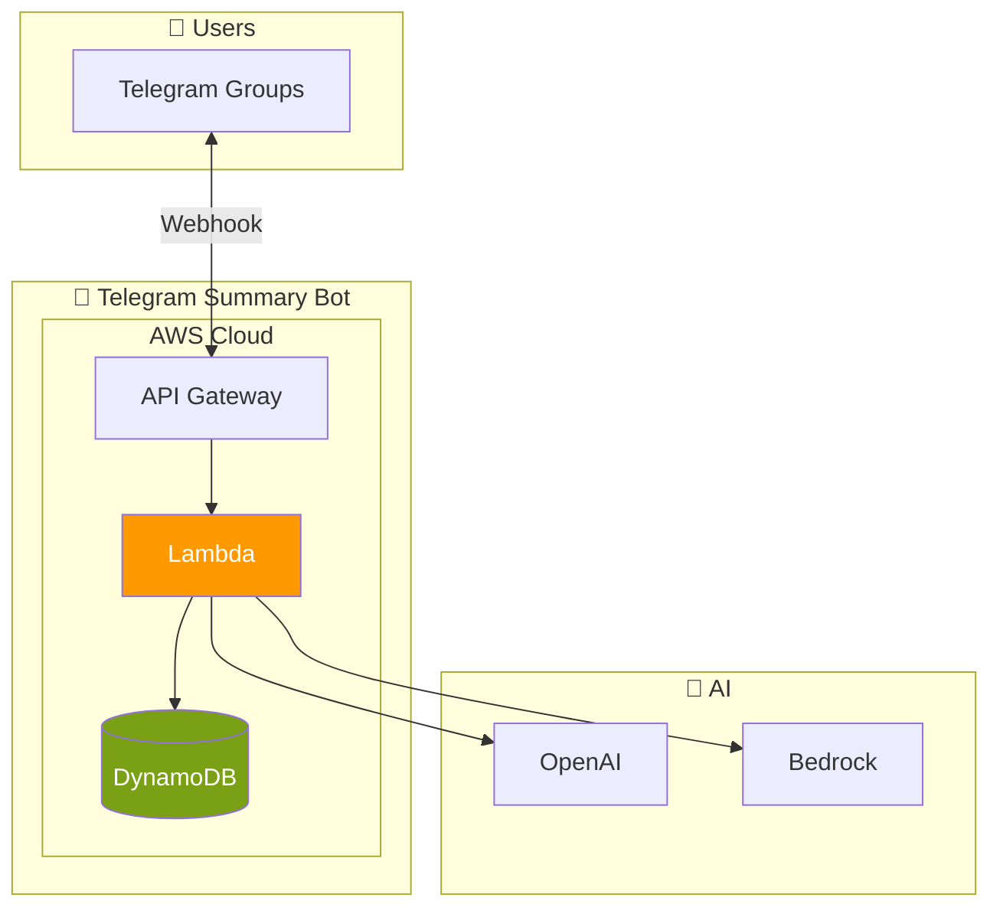
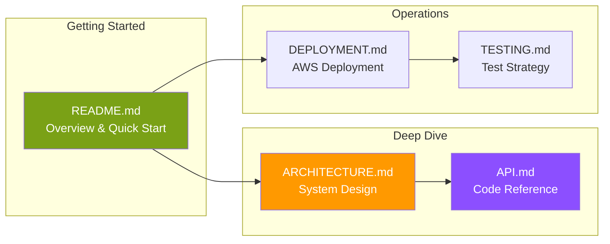

# Telegram AI Summary Bot - Documentation Index

Welcome to the comprehensive documentation for the Telegram AI Summary Bot. This serverless application helps users catch up on missed group chat discussions through AI-powered summaries.

---

## Quick Links

| Document | Description |
|----------|-------------|
| [README](README.md) | Project overview, features, and quick start |
| [Architecture](ARCHITECTURE.md) | C4 diagrams, data flows, and design decisions |
| [API Reference](API.md) | Interfaces, types, and usage examples |
| [Deployment Guide](DEPLOYMENT.md) | AWS SAM deployment and configuration |
| [Testing Guide](TESTING.md) | Test strategy, unit tests, and property tests |

---

## System Overview



---

## Key Features

### Commands

| Command | Description |
|---------|-------------|
| `/summary` | Summarize last 24 hours |
| `/summary 2h` | Summarize last 2 hours |
| `/summary 50` | Summarize last 50 messages |
| `/help` | Show help and privacy info |

### Architecture Highlights

- **Serverless**: AWS Lambda + API Gateway + DynamoDB
- **Cost-Effective**: Operates within AWS Free Tier
- **Privacy-First**: 72-hour message TTL, auto-deletion
- **Pluggable AI**: OpenAI GPT-3.5 or AWS Bedrock Claude

---

## Documentation Map



---

## Quick Start

```bash
# 1. Install dependencies
npm install

# 2. Build
npm run bundle:prod

# 3. Deploy (first time)
npm run deploy:guided

# 4. Register webhook
npm run register-webhook

# 5. Test - add bot to a group and send /help
```

---

## Project Structure

```
telegram-summary-bot/
├── docs/                    # 📚 Documentation
│   ├── INDEX.md            # This file
│   ├── README.md           # Project overview
│   ├── ARCHITECTURE.md     # System design
│   ├── API.md              # Code reference
│   ├── DEPLOYMENT.md       # Deployment guide
│   └── TESTING.md          # Testing guide
├── src/                     # 💻 Source code
│   ├── handler.ts          # Lambda entry point
│   ├── types.ts            # TypeScript interfaces
│   ├── ai/                 # AI provider abstraction
│   ├── commands/           # Command handlers
│   ├── errors/             # Error handling
│   ├── store/              # DynamoDB operations
│   ├── summary/            # Summary generation
│   └── telegram/           # Telegram API client
├── events/                  # 🧪 Test events
├── scripts/                 # 🔧 Deployment scripts
├── template.yaml            # ☁️ SAM template
└── package.json            # 📦 Dependencies
```

---

## Technology Stack

| Layer | Technology |
|-------|------------|
| Runtime | Node.js 18.x (ARM64) |
| Language | TypeScript |
| Compute | AWS Lambda |
| API | AWS API Gateway (HTTP API) |
| Storage | AWS DynamoDB |
| AI | OpenAI GPT-3.5 / AWS Bedrock Claude |
| IaC | AWS SAM |
| Testing | Jest + fast-check |

---

## Cost Summary

| Component | Monthly Cost |
|-----------|--------------|
| AWS (Lambda, API GW, DynamoDB) | $0.00 (free tier) |
| OpenAI API | ~$0.10-0.50 |
| **Total** | **~$0.10-0.50** |

---

## Support

For issues or questions:
1. Check the [Troubleshooting](DEPLOYMENT.md#troubleshooting) section
2. Review [CloudWatch logs](DEPLOYMENT.md#viewing-logs)
3. Open an issue in the repository

---

## License

MIT License
