# Telegram AI Summary Bot

A serverless application that helps users catch up on missed group chat discussions through AI-powered summaries. Built on AWS Lambda, DynamoDB, and supports pluggable AI providers (OpenAI or AWS Bedrock/Claude).

## Table of Contents

- [Overview](#overview)
- [Architecture](#architecture)
- [Features](#features)
- [Getting Started](#getting-started)
- [Configuration](#configuration)
- [Commands](#commands)
- [Cost Optimization](#cost-optimization)
- [Development](#development)
- [Testing](#testing)

---

## Overview

The Telegram Summary Bot is designed to help users quickly understand missed discussions in Telegram group chats by generating concise AI-powered summaries. Key design principles:

- **Cost-effective**: Operates within AWS Free Tier
- **Privacy-first**: Messages auto-expire after 72 hours
- **Pluggable AI**: Supports OpenAI GPT-3.5 or AWS Bedrock Claude 3 Haiku
- **Multi-language**: Auto-detects message language and responds in the same language
- **Forward Attribution**: Tracks forwarded messages and attributes content to original authors
- **Photo Captions**: Captures image descriptions/captions for inclusion in summaries

```mermaid
flowchart LR
    subgraph Users["👥 Users"]
        TG[Telegram Group]
    end
    
    subgraph Bot["🤖 Summary Bot"]
        Lambda[AWS Lambda]
    end
    
    subgraph AI["🧠 AI Providers"]
        OpenAI[OpenAI GPT-3.5]
        Bedrock[AWS Bedrock<br/>Claude 3 Haiku]
    end
    
    TG -->|"/summary"| Lambda
    Lambda -->|"Generate"| OpenAI
    Lambda -->|"Generate"| Bedrock
    Lambda -->|"📝 Summary"| TG
    
    style Lambda fill:#FF9900,color:#fff
    style OpenAI fill:#10A37F,color:#fff
    style Bedrock fill:#232F3E,color:#fff
```



---

## Architecture

### High-Level Architecture


### Request Flow Sequence

```mermaid
sequenceDiagram
    autonumber
    participant U as 👤 User
    participant TG as Telegram API
    participant GW as API Gateway
    participant L as Lambda
    participant DB as DynamoDB
    participant AI as AI Provider
    
    rect rgb(255, 153, 0, 0.1)
        Note over U,DB: Message Ingestion Flow
        U->>TG: Send text message
        TG->>GW: POST /webhook
        GW->>L: Invoke handler
        L->>DB: Store message (TTL: 72h)
        L-->>GW: 200 OK
        GW-->>TG: Acknowledge
    end
    
    rect rgb(35, 47, 62, 0.1)
        Note over U,AI: Summary Generation Flow
        U->>TG: /summary 2h
        TG->>GW: POST /webhook
        GW->>L: Invoke handler
        L->>L: Parse command (2h → time range)
        L->>DB: Query messages (last 2 hours)
        DB-->>L: Messages[]
        L->>AI: Summarize messages
        AI-->>L: Summary text
        L->>TG: Send summary message
        TG-->>U: 📝 Summary displayed
        L-->>GW: 200 OK
    end
```



### Component Architecture


---

## Features

### Bot Commands

| Command | Description | Example |
|---------|-------------|---------|
| `/summary` | Summarize last 24 hours (default) | `/summary` |
| `/summary Nh` | Summarize last N hours | `/summary 2h` |
| `/summary Nm` | Summarize last N minutes | `/summary 30m` |
| `/summary N` | Summarize last N messages | `/summary 50` |
| `/help` | Show help and privacy info | `/help` |

### Message Processing


Note: Messages with photo captions are stored with a `[📷 Photo]` prefix to provide context in summaries.

### Hierarchical Summarization

For long conversations exceeding AI token limits:

```mermaid
flowchart LR
    subgraph Input["📨 Messages"]
        M[1000+ Messages]
    end
    
    subgraph Chunking["✂️ Split"]
        C1[Chunk 1<br/>~300 msgs]
        C2[Chunk 2<br/>~300 msgs]
        C3[Chunk 3<br/>~300 msgs]
    end
    
    subgraph Summaries["📝 Chunk Summaries"]
        S1[Summary 1]
        S2[Summary 2]
        S3[Summary 3]
    end
    
    subgraph Final["🎯 Final"]
        F[Combined<br/>Summary]
    end
    
    M --> C1 & C2 & C3
    C1 --> S1
    C2 --> S2
    C3 --> S3
    S1 & S2 & S3 --> F
    
    style M fill:#232F3E,color:#fff
    style F fill:#FF9900,color:#fff
```



---

## Getting Started

### Prerequisites

- Node.js 18+
- AWS CLI configured
- AWS SAM CLI
- Telegram Bot Token (from [@BotFather](https://t.me/botfather))
- OpenAI API Key (if using OpenAI provider)

### Installation

```bash
# Clone the repository
git clone <repository-url>
cd telegram-summary-bot

# Install dependencies
npm install

# Build the project
npm run bundle:prod
```

### Deployment

```bash
# First-time deployment (guided)
npm run deploy:guided

# Subsequent deployments
npm run deploy

# Register webhook with Telegram
npm run register-webhook
```

### Local Testing

```bash
# Start DynamoDB Local (requires Docker)
docker-compose up -d

# Run tests
npm test

# Test Lambda locally
npm run sam:local
```

---

## Configuration

### Environment Variables

| Variable | Description | Default |
|----------|-------------|---------|
| `TELEGRAM_BOT_TOKEN` | Telegram Bot API token | Required |
| `LLM_PROVIDER` | AI provider (`openai` or `bedrock`) | `openai` |
| `OPENAI_API_KEY` | OpenAI API key | Required if using OpenAI |
| `DYNAMODB_TABLE` | DynamoDB table name | `telegram-summary-messages` |
| `MESSAGE_TTL_HOURS` | Message retention period | `72` |
| `DEFAULT_SUMMARY_HOURS` | Default summary window | `24` |

### SAM Parameters

```yaml
Parameters:
  TelegramBotToken:     # Bot API token (encrypted)
  OpenAIApiKey:         # OpenAI key (encrypted)
  LLMProvider:          # 'openai' or 'bedrock'
  MessageTTLHours:      # Message retention (1-168)
  DefaultSummaryHours:  # Default window (1-72)
  LogRetentionDays:     # CloudWatch retention
```

---

## Cost Optimization

### AWS Free Tier Alignment


### Estimated Monthly Cost

| Component | Cost |
|-----------|------|
| AWS Lambda | $0.00 (free tier) |
| API Gateway | $0.00 (free tier) |
| DynamoDB | $0.00 (free tier) |
| CloudWatch | $0.00 (free tier) |
| OpenAI API | ~$0.10-0.50 |
| **Total** | **~$0.10-0.50/month** |

---

## Development

### Project Structure

```
telegram-summary-bot/
├── src/
│   ├── handler.ts              # Lambda entry point
│   ├── types.ts                # TypeScript interfaces
│   ├── ai/
│   │   ├── ai-provider.ts      # AI provider interface
│   │   ├── openai-provider.ts  # OpenAI implementation
│   │   └── bedrock-provider.ts # Bedrock implementation
│   ├── commands/
│   │   ├── command-router.ts   # Command routing
│   │   ├── help-handler.ts     # /help command
│   │   └── summary-handler.ts  # /summary command
│   ├── errors/
│   │   └── error-handler.ts    # Centralized error handling
│   ├── store/
│   │   └── message-store.ts    # DynamoDB operations
│   ├── summary/
│   │   ├── summary-engine.ts   # Summary orchestration
│   │   └── summary-formatter.ts# Output formatting
│   └── telegram/
│       └── telegram-client.ts  # Telegram API client
├── events/                     # Test event payloads
├── scripts/                    # Deployment scripts
├── template.yaml               # SAM template
└── package.json
```

### Key Interfaces

```typescript
// AI Provider Interface
interface AIProvider {
  summarize(messages: string[], options?: SummarizeOptions): Promise<string>;
  getMaxContextTokens(): number;
}

// Message Store Interface
interface MessageStore {
  store(message: StoredMessage): Promise<void>;
  query(query: MessageQuery): Promise<StoredMessage[]>;
  deleteAll(chatId: number): Promise<void>;
}

// Command Handler Interface
interface CommandHandler {
  execute(message: Message, args: string[]): Promise<void>;
}
```

---

## Testing

### Test Categories


### Running Tests

```bash
# Run all tests
npm test

# Run with coverage
npm run test:coverage

# Run in watch mode
npm run test:watch
```

### Property-Based Tests

The project uses `fast-check` for property-based testing with 100+ iterations:

1. **Message Storage Completeness** - All required fields stored
2. **Non-Text Message Filtering** - Media/stickers ignored
3. **TTL Configuration** - Exactly 72 hours from timestamp
4. **Time Parameter Parsing** - Correct duration calculation
5. **Count Parameter Parsing** - Correct limit values
6. **Summary Output Formatting** - Required elements present
7. **AI Error Handling** - No sensitive data exposed
8. **Hierarchical Summarization** - Proper chunking behavior

---

## Data Model

### DynamoDB Schema

```mermaid
erDiagram
    messages {
        number chatId PK "Telegram chat ID"
        number timestamp SK "Message timestamp (ms)"
        number messageId "Telegram message ID"
        number userId "Sender's user ID"
        string username "Sender's username"
        string text "Message content"
        number expireAt "TTL timestamp (epoch sec)"
        number replyToMessageId "Reply thread context"
        number threadId "Forum topic ID"
        string forwardFromName "Original author (forwarded)"
    }
```

### Access Patterns

| Pattern | Key Condition | Use Case |
|---------|---------------|----------|
| Store message | `chatId` + `timestamp` | Message ingestion |
| Query by time | `chatId` + `timestamp BETWEEN` | Time-based summary |
| Query by count | `chatId` + `Limit` | Count-based summary |
| Delete all | `chatId` | Chat cleanup |

---

## Error Handling

### Error Flow

```mermaid
flowchart TD
    subgraph Errors["❌ Error Types"]
        E1[NoMessagesError]
        E2[AIProviderError]
        E3[AIProviderTimeoutError]
        E4[DynamoDBError]
        E5[InvalidCommandError]
    end
    
    subgraph Handler["🛡️ Error Handler"]
        H[handleError]
        S[sanitizeMessage]
        M[getUserFriendlyMessage]
    end
    
    subgraph Output["📤 User Response"]
        O[User-Friendly Message<br/>No sensitive data]
    end
    
    E1 & E2 & E3 & E4 & E5 --> H
    H --> S
    S --> M
    M --> O
    
    style H fill:#DD344C,color:#fff
    style O fill:#7AA116,color:#fff
```



### User-Friendly Messages

| Error Type | User Message |
|------------|--------------|
| No messages | "No recent messages to summarize. Try a longer time range." |
| AI timeout | "Summary generation is taking too long. Please try again." |
| AI error | "Unable to generate summary right now. Please try again later." |
| Invalid command | "Invalid command. Use /help to see available commands." |

---

## License

MIT License
