# Testing Guide

This document covers the testing strategy, test types, and how to run tests for the Telegram AI Summary Bot.

---

## Table of Contents

- [Overview](#overview)
- [Test Categories](#test-categories)
- [Running Tests](#running-tests)
- [Unit Tests](#unit-tests)
- [Property-Based Tests](#property-based-tests)
- [Integration Tests](#integration-tests)
- [Test Coverage](#test-coverage)

---

## Overview

### Testing Philosophy


### Test Distribution

| Category | Count | Purpose |
|----------|-------|---------|
| Unit Tests | ~400 | Specific examples, edge cases |
| Property Tests | ~60 | Universal properties, 100+ iterations each |
| Integration Tests | ~10 | Component interactions |
| **Total** | **466** | Full test coverage |

---

## Test Categories

### Unit Tests

Test specific examples and edge cases for individual functions.

```mermaid
flowchart LR
    subgraph Unit["🧪 Unit Tests"]
        CP[Command Parsing]
        MS[Message Storage]
        SF[Summary Formatting]
        EH[Error Handling]
        TP[Time/Count Parsing]
    end
    
    style CP fill:#FF9900,color:#fff
    style MS fill:#7AA116,color:#fff
```



**Files:**
- `src/commands/command-router.test.ts`
- `src/commands/help-handler.test.ts`
- `src/commands/summary-handler.test.ts`
- `src/store/message-store.test.ts`
- `src/summary/summary-engine.test.ts`
- `src/summary/summary-formatter.test.ts`
- `src/ai/ai-provider.test.ts`
- `src/ai/openai-provider.test.ts`
- `src/ai/bedrock-provider.test.ts`
- `src/telegram/telegram-client.test.ts`
- `src/errors/error-handler.test.ts`
- `src/handler.test.ts`

### Property-Based Tests

Verify universal properties across many generated inputs using `fast-check`.

```mermaid
flowchart TB
    subgraph Properties["🔬 Property Tests"]
        P1[Message Storage<br/>Completeness]
        P2[Non-Text Message<br/>Filtering]
        P3[TTL Configuration<br/>72h exactly]
        P4[Time Parameter<br/>Parsing]
        P5[Count Parameter<br/>Parsing]
        P6[Summary Output<br/>Formatting]
        P7[AI Error<br/>Handling]
        P8[Hierarchical<br/>Summarization]
    end
    
    style P1 fill:#8C4FFF,color:#fff
    style P3 fill:#8C4FFF,color:#fff
    style P6 fill:#8C4FFF,color:#fff
```



**Files:**
- `src/ai/ai-provider.property.test.ts`
- `src/commands/summary-handler.property.test.ts`
- `src/store/message-store.property.test.ts`
- `src/summary/summary-engine.property.test.ts`
- `src/summary/summary-formatter.property.test.ts`
- `src/handler.property.test.ts`

---

## Running Tests

### All Tests

```bash
npm test
```

### Watch Mode

```bash
npm run test:watch
```

### With Coverage

```bash
npm run test:coverage
```

### Specific Test File

```bash
npm test -- src/commands/command-router.test.ts
```

### Specific Test Pattern

```bash
npm test -- --testNamePattern="parseCommand"
```

### Property Tests Only

```bash
npm test -- --testPathPattern="property"
```

---

## Unit Tests

### Command Router Tests

```typescript
// src/commands/command-router.test.ts

describe('parseCommand', () => {
  it('should parse command without arguments', () => {
    const result = parseCommand('/help');
    expect(result).toEqual({
      command: '/help',
      commandName: 'help',
      args: [],
      rawArgs: '',
    });
  });

  it('should parse command with arguments', () => {
    const result = parseCommand('/summary 2h');
    expect(result).toEqual({
      command: '/summary',
      commandName: 'summary',
      args: ['2h'],
      rawArgs: '2h',
    });
  });

  it('should handle bot username mentions', () => {
    const result = parseCommand('/summary@MyBot 50');
    expect(result?.commandName).toBe('summary');
    expect(result?.args).toEqual(['50']);
  });

  it('should return null for non-commands', () => {
    expect(parseCommand('hello')).toBeNull();
    expect(parseCommand('')).toBeNull();
  });
});
```

### Summary Handler Tests

```typescript
// src/commands/summary-handler.test.ts

describe('parseTimeParameter', () => {
  it('should parse hours', () => {
    expect(parseTimeParameter('1h')).toBe(1);
    expect(parseTimeParameter('2h')).toBe(2);
    expect(parseTimeParameter('24h')).toBe(24);
  });

  it('should parse minutes', () => {
    expect(parseTimeParameter('30m')).toBe(0.5);
    expect(parseTimeParameter('60m')).toBe(1);
    expect(parseTimeParameter('90m')).toBe(1.5);
  });

  it('should return null for invalid formats', () => {
    expect(parseTimeParameter('abc')).toBeNull();
    expect(parseTimeParameter('0h')).toBeNull();
    expect(parseTimeParameter('-1h')).toBeNull();
  });
});

describe('parseCountParameter', () => {
  it('should parse positive integers', () => {
    expect(parseCountParameter('50')).toBe(50);
    expect(parseCountParameter('100')).toBe(100);
  });

  it('should return null for invalid formats', () => {
    expect(parseCountParameter('0')).toBeNull();
    expect(parseCountParameter('-5')).toBeNull();
    expect(parseCountParameter('abc')).toBeNull();
  });
});

describe('parseSummaryParameter', () => {
  it('should default to 24 hours', () => {
    expect(parseSummaryParameter()).toEqual({ type: 'time', value: 24 });
    expect(parseSummaryParameter('')).toEqual({ type: 'time', value: 24 });
  });

  it('should parse time parameters', () => {
    expect(parseSummaryParameter('2h')).toEqual({ type: 'time', value: 2 });
  });

  it('should parse count parameters', () => {
    expect(parseSummaryParameter('50')).toEqual({ type: 'count', value: 50 });
  });
});
```

### Message Store Tests

```typescript
// src/store/message-store.test.ts

describe('DynamoDBMessageStore', () => {
  let store: DynamoDBMessageStore;
  let mockClient: jest.Mocked<DynamoDBClient>;

  beforeEach(() => {
    mockClient = {
      send: jest.fn(),
    } as any;
    store = new DynamoDBMessageStore(mockClient, 'test-table', 72);
  });

  describe('store', () => {
    it('should store message with TTL', async () => {
      const message: StoredMessage = {
        chatId: -1001234567890,
        timestamp: 1699999999000,
        messageId: 12345,
        userId: 987654321,
        username: 'test_user',
        text: 'Hello, world!',
        expireAt: 0,
      };

      await store.store(message);

      expect(mockClient.send).toHaveBeenCalledWith(
        expect.objectContaining({
          input: expect.objectContaining({
            TableName: 'test-table',
          }),
        })
      );
    });
  });

  describe('query', () => {
    it('should query by time range', async () => {
      mockClient.send.mockResolvedValue({ Items: [] });

      await store.query({
        chatId: -1001234567890,
        startTime: 1699999000000,
        endTime: 1699999999000,
      });

      expect(mockClient.send).toHaveBeenCalled();
    });

    it('should query by count', async () => {
      mockClient.send.mockResolvedValue({ Items: [] });

      await store.query({
        chatId: -1001234567890,
        limit: 50,
      });

      expect(mockClient.send).toHaveBeenCalled();
    });
  });
});
```

### Error Handler Tests

```typescript
// src/errors/error-handler.test.ts

describe('handleError', () => {
  it('should return user-friendly message for NoMessagesError', () => {
    const error = new NoMessagesError();
    const response = handleError(error);
    
    expect(response.success).toBe(false);
    expect(response.userMessage).toBe('No recent messages to summarize. Try a longer time range.');
    expect(response.errorCode).toBe('NO_MESSAGES');
  });

  it('should not expose sensitive data', () => {
    const error = new Error('API key sk-abc123xyz is invalid');
    const response = handleError(error);
    
    expect(response.userMessage).not.toContain('sk-');
    expect(response.userMessage).not.toContain('abc123xyz');
  });
});

describe('sanitizeMessage', () => {
  it('should redact API keys', () => {
    const text = 'Error with key sk-abcdefghijklmnopqrstuvwxyz';
    const sanitized = sanitizeMessage(text);
    
    expect(sanitized).toContain('[REDACTED]');
    expect(sanitized).not.toContain('sk-');
  });

  it('should redact Telegram tokens', () => {
    const text = 'Token: 123456789:ABCdefGHIjklMNOpqrsTUVwxyz123';
    const sanitized = sanitizeMessage(text);
    
    expect(sanitized).toContain('[REDACTED]');
  });
});
```

---

## Property-Based Tests

Property-based tests use `fast-check` to generate random inputs and verify that properties hold across all of them.

### Configuration

```typescript
// jest.config.js
module.exports = {
  // ...
  testTimeout: 30000, // Property tests may take longer
};

// In test files
import * as fc from 'fast-check';

fc.configureGlobal({
  numRuns: 100,
  verbose: true,
});
```

### Property 1: Message Storage Completeness

```typescript
// src/store/message-store.property.test.ts

describe('Property: Message Storage Completeness', () => {
  it('should store all required fields for any valid text message', () => {
    fc.assert(
      fc.property(
        fc.record({
          chatId: fc.integer(),
          timestamp: fc.integer({ min: 0 }),
          messageId: fc.integer({ min: 1 }),
          userId: fc.integer({ min: 1 }),
          username: fc.string({ minLength: 1 }),
          text: fc.string({ minLength: 1 }),
        }),
        (input) => {
          const message: StoredMessage = {
            ...input,
            expireAt: 0,
          };
          
          // All required fields must be present and non-null
          expect(message.chatId).toBeDefined();
          expect(message.timestamp).toBeDefined();
          expect(message.messageId).toBeDefined();
          expect(message.userId).toBeDefined();
          expect(message.username).toBeDefined();
          expect(message.text).toBeDefined();
        }
      ),
      { numRuns: 100 }
    );
  });
});
```

### Property 2: Non-Text Message Filtering

```typescript
// src/handler.property.test.ts

describe('Property: Non-Text Message Filtering', () => {
  it('should not store non-text messages', () => {
    fc.assert(
      fc.property(
        fc.oneof(
          // Sticker message
          fc.record({
            message_id: fc.integer(),
            chat: fc.record({ id: fc.integer(), type: fc.constant('group') }),
            date: fc.integer(),
            sticker: fc.record({ file_id: fc.string() }),
          }),
          // Photo message
          fc.record({
            message_id: fc.integer(),
            chat: fc.record({ id: fc.integer(), type: fc.constant('group') }),
            date: fc.integer(),
            photo: fc.array(fc.record({ file_id: fc.string() })),
          }),
        ),
        (message) => {
          expect(isTextMessage(message as any)).toBe(false);
        }
      ),
      { numRuns: 100 }
    );
  });
});
```

### Property 3: TTL Configuration

```typescript
// src/store/message-store.property.test.ts

describe('Property: TTL Configuration', () => {
  it('should set expireAt to exactly 72 hours after timestamp', () => {
    const TTL_HOURS = 72;
    const TTL_SECONDS = TTL_HOURS * 60 * 60;
    
    fc.assert(
      fc.property(
        fc.integer({ min: 1000000000000, max: 2000000000000 }), // Valid timestamps
        (timestampMs) => {
          const store = new DynamoDBMessageStore(undefined, 'test', TTL_HOURS);
          const expireAt = store['calculateExpireAt'](timestampMs);
          
          const timestampSeconds = Math.floor(timestampMs / 1000);
          const expectedExpireAt = timestampSeconds + TTL_SECONDS;
          
          expect(expireAt).toBe(expectedExpireAt);
        }
      ),
      { numRuns: 100 }
    );
  });
});
```

### Property 4: Time Parameter Parsing

```typescript
// src/commands/summary-handler.property.test.ts

describe('Property: Time Parameter Parsing', () => {
  it('should correctly parse valid time parameters', () => {
    fc.assert(
      fc.property(
        fc.integer({ min: 1, max: 168 }),
        fc.constantFrom('h', 'm'),
        (value, unit) => {
          const param = `${value}${unit}`;
          const result = parseTimeParameter(param);
          
          expect(result).not.toBeNull();
          
          if (unit === 'h') {
            expect(result).toBe(value);
          } else {
            expect(result).toBe(value / 60);
          }
        }
      ),
      { numRuns: 100 }
    );
  });
});
```

### Property 5: Count Parameter Parsing

```typescript
// src/commands/summary-handler.property.test.ts

describe('Property: Count Parameter Parsing', () => {
  it('should correctly parse valid count parameters', () => {
    fc.assert(
      fc.property(
        fc.integer({ min: 1, max: 10000 }),
        (count) => {
          const param = String(count);
          const result = parseCountParameter(param);
          
          expect(result).toBe(count);
        }
      ),
      { numRuns: 100 }
    );
  });
});
```

### Property 6: Summary Output Formatting

```typescript
// src/summary/summary-formatter.property.test.ts

describe('Property: Summary Output Formatting', () => {
  it('should contain required elements for any non-empty summary', () => {
    fc.assert(
      fc.property(
        fc.string({ minLength: 10 }),
        (rawSummary) => {
          const formatter = new DefaultSummaryFormatter();
          const formatted = formatter.format(rawSummary);
          
          // Must contain header emoji
          expect(formatted).toContain('🧵');
          
          // Must contain bullet points
          expect(formatted).toContain('•');
        }
      ),
      { numRuns: 100 }
    );
  });
});
```

### Property 7: AI Error Handling

```typescript
// src/ai/ai-provider.property.test.ts

describe('Property: AI Error Handling', () => {
  it('should never expose sensitive data in error messages', () => {
    const sensitivePatterns = [
      /sk-[a-zA-Z0-9]{20,}/,
      /\d{9,}:[a-zA-Z0-9_-]{35}/,
      /AKIA[0-9A-Z]{16}/,
    ];
    
    fc.assert(
      fc.property(
        fc.string(),
        fc.constantFrom('openai', 'bedrock'),
        (errorMessage, provider) => {
          const error = new AIProviderError(errorMessage, provider as any);
          const response = handleError(error);
          
          for (const pattern of sensitivePatterns) {
            expect(response.userMessage).not.toMatch(pattern);
          }
        }
      ),
      { numRuns: 100 }
    );
  });
});
```

### Property 8: Hierarchical Summarization

```typescript
// src/summary/summary-engine.property.test.ts

describe('Property: Hierarchical Summarization', () => {
  it('should split messages into valid chunks', () => {
    fc.assert(
      fc.property(
        fc.array(fc.string({ minLength: 10, maxLength: 500 }), { minLength: 10, maxLength: 100 }),
        (messages) => {
          const engine = new DefaultSummaryEngine(mockStore, mockProvider);
          const chunks = engine.splitIntoChunks(messages);
          
          // All chunks should be non-empty
          for (const chunk of chunks) {
            expect(chunk.length).toBeGreaterThan(0);
          }
          
          // Total messages in chunks should be >= original
          // (may be more due to overlap)
          const totalInChunks = chunks.reduce((sum, c) => sum + c.length, 0);
          expect(totalInChunks).toBeGreaterThanOrEqual(messages.length);
        }
      ),
      { numRuns: 100 }
    );
  });
});
```

---

## Integration Tests

### Webhook Flow Test

```typescript
// src/handler.integration.test.ts

describe('Webhook Integration', () => {
  it('should process text message end-to-end', async () => {
    const event = {
      body: JSON.stringify({
        update_id: 123,
        message: {
          message_id: 456,
          chat: { id: -1001234567890, type: 'supergroup' },
          from: { id: 987654321, first_name: 'Test' },
          date: Math.floor(Date.now() / 1000),
          text: 'Hello, world!',
        },
      }),
    };

    const result = await handler(event as any);

    expect(result.statusCode).toBe(200);
    expect(JSON.parse(result.body)).toEqual({ ok: true });
  });
});
```

### AI Provider Integration

```typescript
// src/ai/openai-provider.integration.test.ts

describe('OpenAI Provider Integration', () => {
  // Skip if no API key
  const apiKey = process.env.OPENAI_API_KEY;
  const describeOrSkip = apiKey ? describe : describe.skip;

  describeOrSkip('with real API', () => {
    it('should generate summary', async () => {
      const provider = new OpenAIProvider(apiKey);
      
      const summary = await provider.summarize([
        '[10:00] Alice: Has anyone reviewed the PR?',
        '[10:05] Bob: I\'ll take a look now',
      ]);

      expect(summary).toBeTruthy();
      expect(summary.length).toBeGreaterThan(0);
    });
  });
});
```

---

## Test Coverage

### Running Coverage

```bash
npm run test:coverage
```

### Coverage Report

```
-----------------------------|---------|----------|---------|---------|
File                         | % Stmts | % Branch | % Funcs | % Lines |
-----------------------------|---------|----------|---------|---------|
All files                    |   85.5  |   78.2   |   90.1  |   85.5  |
 src/ai                      |   82.3  |   75.0   |   88.9  |   82.3  |
 src/commands                |   90.2  |   85.7   |   95.0  |   90.2  |
 src/errors                  |   88.1  |   80.0   |   92.3  |   88.1  |
 src/store                   |   85.0  |   76.5   |   87.5  |   85.0  |
 src/summary                 |   87.5  |   82.4   |   91.7  |   87.5  |
 src/telegram                |   80.0  |   70.0   |   85.7  |   80.0  |
-----------------------------|---------|----------|---------|---------|
```

### Coverage Thresholds

```javascript
// jest.config.js
module.exports = {
  coverageThreshold: {
    global: {
      branches: 75,
      functions: 85,
      lines: 80,
      statements: 80,
    },
  },
};
```

---

## Test Utilities

### Mock Factories

```typescript
// test/mocks.ts

export function createMockMessage(overrides?: Partial<Message>): Message {
  return {
    message_id: 12345,
    chat: { id: -1001234567890, type: 'supergroup' },
    from: { id: 987654321, first_name: 'Test', username: 'test_user' },
    date: Math.floor(Date.now() / 1000),
    text: 'Test message',
    ...overrides,
  };
}

export function createMockStoredMessage(overrides?: Partial<StoredMessage>): StoredMessage {
  return {
    chatId: -1001234567890,
    timestamp: Date.now(),
    messageId: 12345,
    userId: 987654321,
    username: 'test_user',
    text: 'Test message',
    expireAt: Math.floor(Date.now() / 1000) + 72 * 60 * 60,
    ...overrides,
  };
}

export function createMockTelegramUpdate(overrides?: Partial<TelegramUpdate>): TelegramUpdate {
  return {
    update_id: 123456789,
    message: createMockMessage(),
    ...overrides,
  };
}
```

### Test Events

Sample events are in the `events/` directory:

- `events/test-message.json` - Text message
- `events/test-summary-command.json` - /summary command
- `events/test-help-command.json` - /help command

```json
// events/test-summary-command.json
{
  "body": "{\"update_id\":123,\"message\":{\"message_id\":456,\"chat\":{\"id\":-1001234567890,\"type\":\"supergroup\"},\"from\":{\"id\":987654321,\"first_name\":\"Test\"},\"date\":1699999999,\"text\":\"/summary 2h\"}}"
}
```
